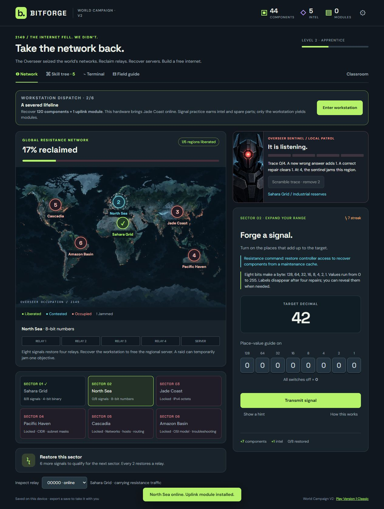

# Bitforge — reclaim the network

A classroom browser game set in a future controlled by the Overseer AI. Restore network infrastructure by learning binary, IPv4, subnetting, and OSI troubleshooting. Recover components and intel, unlock equipment, and enter a simulated workstation to earn the uplink modules needed to continue.

## Download and play

| Version | Game download | What is different |
|---|---|---|
| **1 — Classic** | [Bitforge-v1.html](https://github.com/cmg1249-gif/chat-gpt-scripts/releases/download/bitforge-v1-v2/Bitforge-v1.html) | The preserved original classroom game: research, restoration, and required workstation missions. |
| **2 — World Campaign** | [Bitforge.html](https://github.com/cmg1249-gif/chat-gpt-scripts/releases/download/bitforge-v1-v2/Bitforge.html) | Choose a starting region with a different advantage, watch the world map change, and face an AI sentinel with trace, raids, and recovery objectives. |

1. Download the HTML file for the version you want. If your browser displays its source, use **Save link as** on the download link above.
2. Open the downloaded file in a modern browser, such as Chrome or Firefox (including Firefox on Kali Linux).
3. Play offline. No account, extension, installation, or server is needed. If a school blocks downloaded HTML, ask the teacher to serve the included source through the school's approved web server.

[Download the complete two-version classroom pack](https://github.com/cmg1249-gif/chat-gpt-scripts/releases/download/bitforge-v1-v2/Bitforge-both-versions.zip), or visit the [release page for all downloads](https://github.com/cmg1249-gif/chat-gpt-scripts/releases/tag/bitforge-v1-v2).

The game targets modern browsers; direct browser validation was performed in Chromium. Firefox/Kali and Safari have not been individually verified. The terminal is a simulation inside the game, with Windows-style commands; it never executes commands on the student's computer or accesses its network.

### Download from Windows PowerShell

Download both versions, teacher guides, and source code to your Desktop:

```powershell
$url="https://github.com/cmg1249-gif/chat-gpt-scripts/releases/download/bitforge-v1-v2/Bitforge-both-versions.zip"
$outFile=Join-Path ([Environment]::GetFolderPath('Desktop')) 'Bitforge-both-versions.zip'
(New-Object Net.WebClient).DownloadFile($url, $outFile)
```

Right-click the ZIP, choose **Extract All**, then open `Version-1/Bitforge-v1.html` or `Version-2/Bitforge.html` in your browser. The URL must point to a download, and `$outFile` must include a filename. `GetFolderPath` locates your actual Desktop, including a redirected Desktop. Downloading again replaces the file at that path.

[README-Download.txt](README-Download.txt) also includes separate commands for each version. Run these commands in Windows PowerShell, not in the game's simulated terminal or the default Linux/Kali shell.

## Teaching and progression

Both versions progress from four-bit binary with place-value guides to eight-bit values, IPv4, CIDR masks, subnet calculations, and OSI incident diagnosis. Binary guides fade with practice; students can request help. Required terminal missions begin with command-line basics and grow into troubleshooting. Workstation recoveries supply the modules needed for expansion, so the terminal cannot simply be skipped.

Version 2 adds six regions and 30 restoration objectives. Cascadia tolerates more trace, Sahara rewards more salvage, and Pacific cools trace faster. Distinct wrong answers can trigger a raid and jam an objective. Correct repairs recover the network; there are no idle attacks or losses of banked resources. Normal progression is untimed.

- [Version 1 teacher guide](classic/Teacher-guide.txt)
- [Version 2 teacher guide](world-campaign/Teacher-guide.txt)

Progress is stored in the current browser. Use the in-game save export before changing devices, moving the HTML file, switching versions, clearing browser data, or sharing a computer. Private browsing may discard progress. Release downloads contain the game, not a student's save.



## Editable source

- [Classic source](classic/) · [original source ZIP](https://github.com/cmg1249-gif/chat-gpt-scripts/releases/download/bitforge-v1-v2/Bitforge-v1-source.zip)
- [World Campaign source](world-campaign/) · [original source ZIP](https://github.com/cmg1249-gif/chat-gpt-scripts/releases/download/bitforge-v1-v2/Bitforge-source.zip)

For the checked-in source, use a current Node.js installation and run these commands inside either `classic` or `world-campaign`:

```sh
node tests.mjs
node bundle.mjs
```

Open the generated `build/Bitforge.html`. No npm packages are required. To work with the separate source files instead, serve that version's `dist` folder with a local static HTTP server and open its `index.html`; ES modules should be served over HTTP.

The checked-in bundlers write to a local `build` folder. The original archived source ZIPs preserve the release layout and write to `../../outputs` when bundled from their extracted root. Both approaches reproduce the same game HTML. The frozen Version 1 download is preserved byte for byte. SHA-256 checksums are included with the release.

World Campaign artwork is included in its source; the image-generation prompts are in [generation-prompts.json](world-campaign/dist/assets/generation-prompts.json). The Classic shortcut inside the original V2 game points to the original hosted site, which may require access; use the V1 download above for offline classroom distribution.
